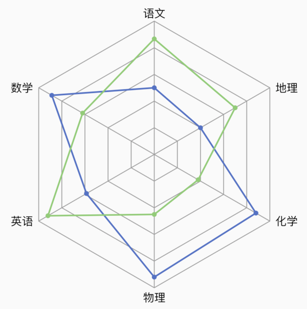
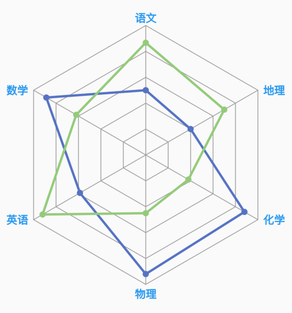
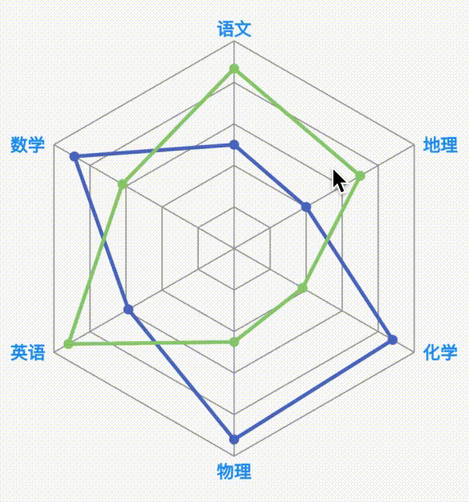

<!--
This README describes the package. If you publish this package to pub.dev,
this README's contents appear on the landing page for your package.

For information about how to write a good package README, see the guide for
[writing package pages](https://dart.dev/guides/libraries/writing-package-pages).

For general information about developing packages, see the Dart guide for
[creating packages](https://dart.dev/guides/libraries/create-library-packages)
and the Flutter guide for
[developing packages and plugins](https://flutter.dev/developing-packages).
-->

## radar_chart_widget

展示一个雷达图（n芒星图）。


交互式的雷达图：可点击轴标题，多边形上的点。


## Install
```
dependencies:
  radar_chart_widget:
```
## How to use
简单数据展示参考example/lib/radar_chart_page.dart。
带有交互的参考example/lib/interactive_radar_chart_page.dart。


